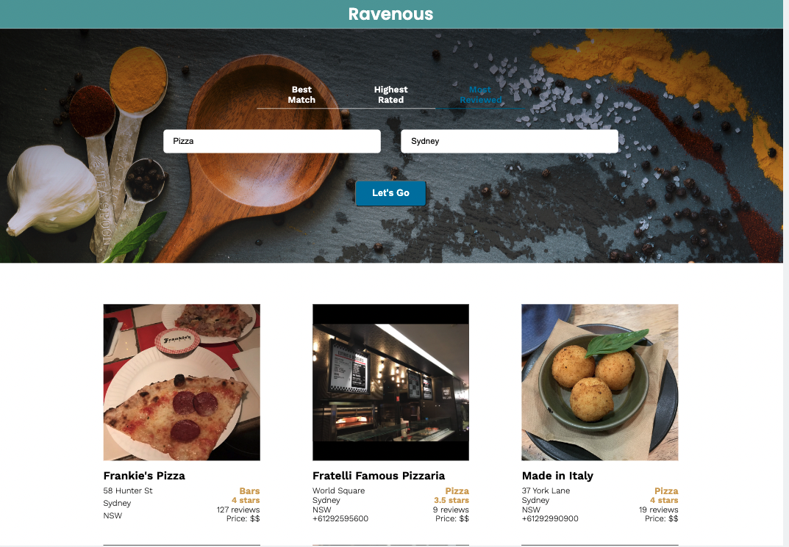

# Interacting with the Yelp API

## Ravenous App Instructions
 
- You can search according to Best Match, Highest Rated and Most Reviewed on the top of search bar.
  
- Simply enter the `food ` or `business name` that you want and the `location`, and then press the `Let's go` button. It will take a few seconds to load the data.

- Example: type Pizza, Sydney, and click Most Reviewed.
  

---

 Fetch() will not function correctly due to [CORS](https://en.wikipedia.org/wiki/Cross-origin_resource_sharing) restrictions.

You can bypass this restriction with an API called [CORS Anywhere](https://cors-anywhere.herokuapp.com/corsdemo). CORS Anywhere will take requests sent to its API endpoint, make them for the requesting app with the proper CORS permissions, and then return the response back to the requesting app.

